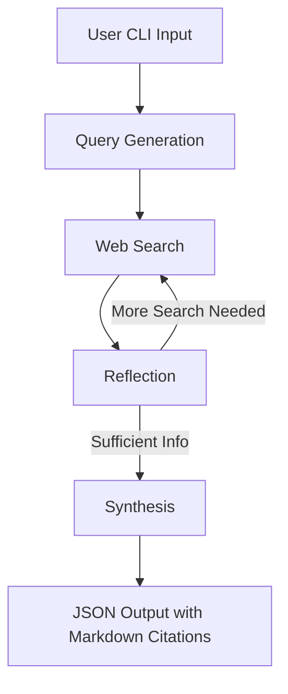

## Architecture



* **User CLI Input:** User enters a natural-language question.
* **Query Generation:** Agent formulates search queries.
* **Web Search:** Executes web searches using APIs.
* **Reflection:** Determines if additional search is needed.
* **Synthesis:** Compiles and cites results in Markdown, outputs JSON.

---

## How to Run

1. **Clone the repository:**

   ```bash
   git clone https://github.com/yourusername/llm-research-agent.git
   cd llm-research-agent
   ```

2. **Configure environment variables:**

   1. Rename `.env.example` to `.env`:

      ```bash
      cp .env.example .env
      ```

   2. Open the `.env` file and fill in your API keys:

      ```
      SERPAPI_API_KEY=your_serpapi_key_here
      GEMINI_API_KEY=your_google_gemini_key_here
      ```

   You can get the keys from:

   * **SerpAPI**: [https://serpapi.com/manage-api-key](https://serpapi.com/manage-api-key)
   * **Google Gemini**: [https://makersuite.google.com/app/apikey](https://makersuite.google.com/app/apikey)

3. **Build and run with Docker:**

   ```bash
   docker build -t llm-research-agent .
   docker run --rm -it --env-file .env llm-research-agent
   ```

4. **Or run locally:**

   ```bash
   pip install -r requirements.txt
   python -m agent.cli
   ```

---

## Extension Ideas

* **Add GUI:** Build a web or desktop interface.
* **Support More LLMs:** Integrate additional model providers.
* **Advanced Tooling:** Add plugins for code search, PDF parsing, or database queries.
* **Multi-language Support:** Enable answers in languages other than English.
* **Caching:** Implement result caching for faster repeated queries.
* **Customizable Output:** Allow users to select output formats (YAML, HTML, etc.).
* **API Server:** Expose agent as a REST API.

---

## Design Document

See [`docs/design.md`](docs/design.md) for a detailed design (≤ 10 pages). Includes:

* System overview and diagrams
* Component responsibilities
* Data flow and error handling
* Testing and deployment strategy
* Future work and extensibility

A fully runnable, testable, Docker-packaged Research LLM Agent that demonstrates:

* **Prompt Engineering**
* **Tool Orchestration** (LangGraph, Web Search, etc.)
* **Engineering Delivery** (tests, Docker, docs)

## Business Scenario

A user types a natural-language question in the terminal. The agent:

1. **Generates queries**
2. **Performs web search**
3. **Reflects** (decides if more search is needed)
4. **Optionally performs a second search**
5. **Synthesizes an answer**

Returns an English answer with Markdown citations in **pure JSON**.

---

## Features

* CLI interface for user questions
* Automated web search and reflection loop
* Answer synthesis with Markdown citations
* JSON output
* Dockerized for easy deployment
* Unit and integration tests

---

## Quickstart

### 1. Clone the repository

```bash
git clone https://github.com/BillVu05/Round-1-code.git
cd llm-research-agent
```

### 2. Build and run with Docker

```bash
docker build -t llm-research-agent .
docker run --rm -it llm-research-agent
```

### 3. Usage

Type your question at the prompt:

```bash
> What is LangGraph and how does it help with tool orchestration?
```

The agent will output a JSON answer with Markdown citations.

---

## Project Structure

```
.
├── agent/
│   ├── __init__.py
│   ├── cli.py
│   ├── core.py
│   ├── search.py
│   ├── synthesize.py
│   └── reflect.py
├── tests/
│   ├── test_core.py
│   ├── test_search.py
│   └── test_synthesize.py
├── Dockerfile
├── requirements.txt
└── README.md
```

---

## Example Output

```json
{
    "answer": "LangGraph is a framework for orchestrating multiple tools and language models in a graph-based workflow [^1]. It enables complex reasoning and tool use in LLM applications.\n\n[^1]: [LangGraph Documentation](https://langchain-ai.github.io/langgraph/)"
}
```

---

## Development

### Install dependencies

```bash
pip install -r requirements.txt
```

### Run tests

```bash
pytest
```

---

## Configuration

* API keys for web search and LLMs are set via environment variables.
* See `.env.example` for details.

---

## License

MIT License

---

## Acknowledgements

* [LangGraph](https://langchain-ai.github.io/langgraph/)
* [SerpAPI Search API](https://serpapi.com/)
* [OpenAI](https://openai.com/)
