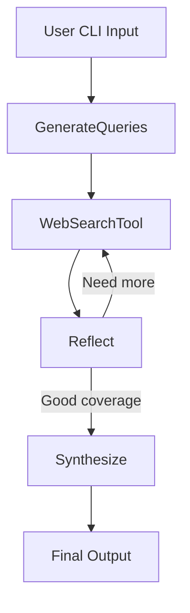

# Design Document: LLM Research Agent

## Overview

The LLM Research Agent is a CLI-based system that answers natural-language research questions by orchestrating a sequence of tools:

1. **LLM query generation**
2. **Web search via SerpAPI**
3. **Self-reflection on coverage of required facts**
4. **Optional second search pass if gaps exist**
5. **Final synthesis into a concise answer with markdown-style citations**

It outputs a pure JSON object containing the answer and citation list.

---

## System Diagram



---

## Component Breakdown

### 1. `GenerateQueries`

* **Input:** A user-supplied natural language question (e.g. "Who won the 2022 FIFA World Cup?")
* **Logic:** Prompts the Gemini LLM to produce 3-5 web search queries.
* **Output:** `{"queries": [...]}`

### 2. `WebSearchTool`

* **Input:** A list of queries.
* **Logic:** Runs all queries concurrently using SerpAPI.
* **Deduplication:** Keeps only unique URLs.
* **Output:** `{"docs": [{"title": ..., "url": ...}]}`

### 3. `Reflect`

* **Input:** Retrieved docs and original queries.
* **Logic:** Uses Gemini to check whether required information slots are filled.
* **Slots:** For now, `['winner', 'score', 'goalscorers']` (extendable).
* **If missing:** Adds targeted queries to `new_queries`.
* **Output:** `{"need_more": true/false, "new_queries": [...], "filled": [...], ...}`

### 4. `Synthesize`

* **Input:** The topic and final document set.
* **Logic:** Uses Gemini to generate a short answer and map citations.
* **Output:** `{ "answer": "...", "citations": [...] }`

---

## Error Handling

| Stage            | Strategy                                                         |
| ---------------- | ---------------------------------------------------------------- |
| LLM JSON parsing | If `json.loads()` fails, log output and fallback to empty result |
| SerpAPI failures | Use `try/except` and skip that result                            |
| Network timeout  | Caught in `WebSearchTool` via ThreadPool + exception fallback    |
| Missing fields   | `Reflect` regenerates targeted queries to compensate             |

---

## Configuration

The agent uses `.env` variables loaded via `dotenv`:

```env
SERPAPI_API_KEY=your_key_here
GEMINI_API_KEY=your_key_here
```

These are injected in the main file and used by both LLM and web search services.

---

## Testing Strategy

The `tests/` folder includes unit tests that mock external dependencies:

* `test_happy_path`: All services succeed, returns valid output.
* `test_no_results`: No documents retrieved.
* `test_http_429`: API throttling is simulated.
* `test_timeout`: Network error from SerpAPI.
* `test_two_round_supplement`: Reflect triggers second round of search.

All tests are run via `pytest`.

---

## Deployment

### Dockerized Build:

```bash
docker build -t llm-research-agent .
docker run --rm -it --env-file .env llm-research-agent "<your question>"
```

### Local Usage:

```bash
pip install -r requirements.txt
python -m agent.cli --topic "<your question>"
```

---

## Extensibility

| Area           | Idea                                                   |
| -------------- | ------------------------------------------------------ |
| Tooling        | Add PDF parsers, code search, WolframAlpha             |
| UI             | Build a web or desktop front-end                       |
| Output Format  | Support HTML/YAML export                               |
| Answer Control | User-defined constraints: tone, length, citation count |
| Slot-Based QA  | Dynamic slot detection based on topic                  |

---

## Conclusion

This project demonstrates structured LLM tool orchestration for research tasks. It maintains robustness across edge cases, supports testing and Docker deployment, and can serve as a base for more advanced autonomous agents.
